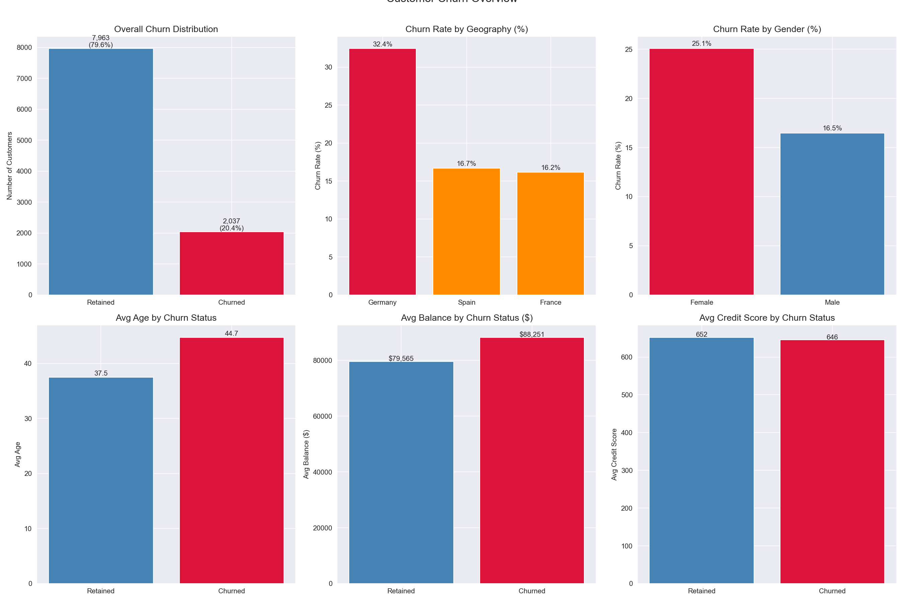
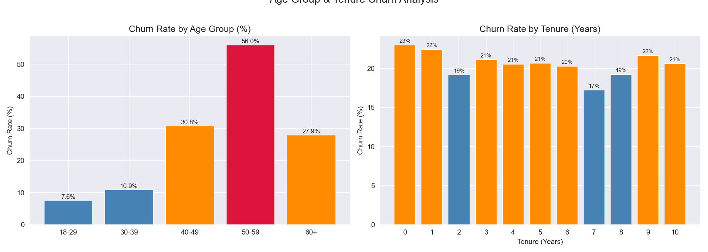
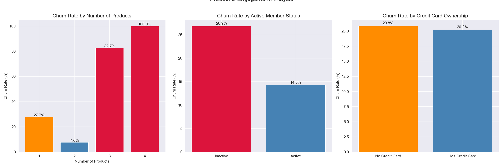
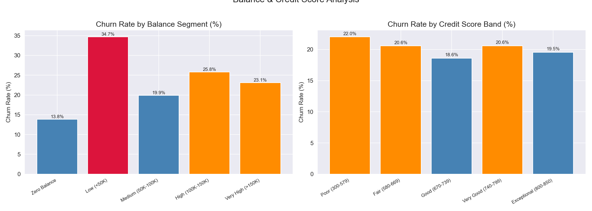
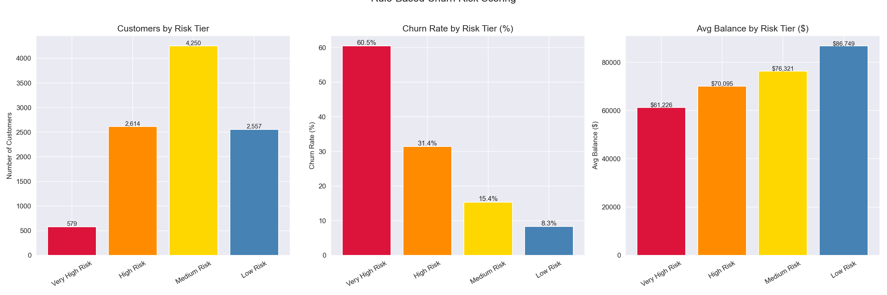
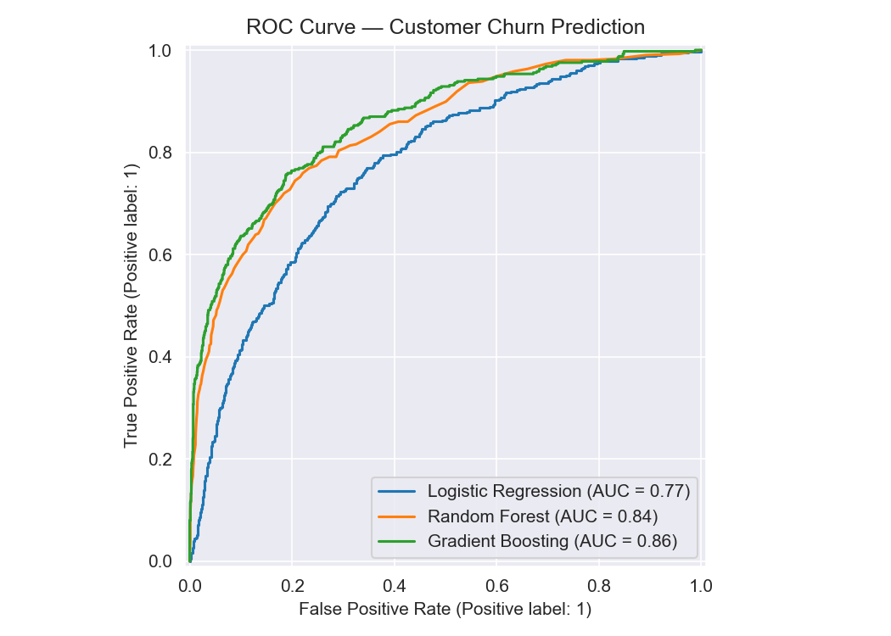
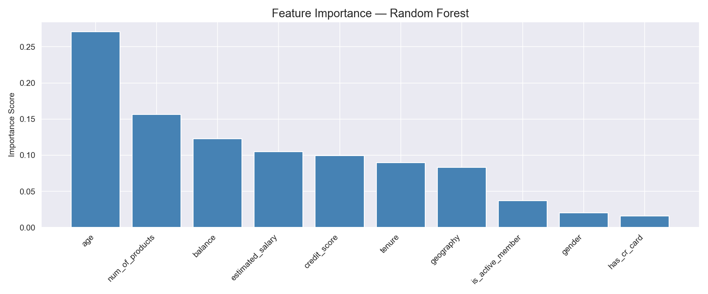
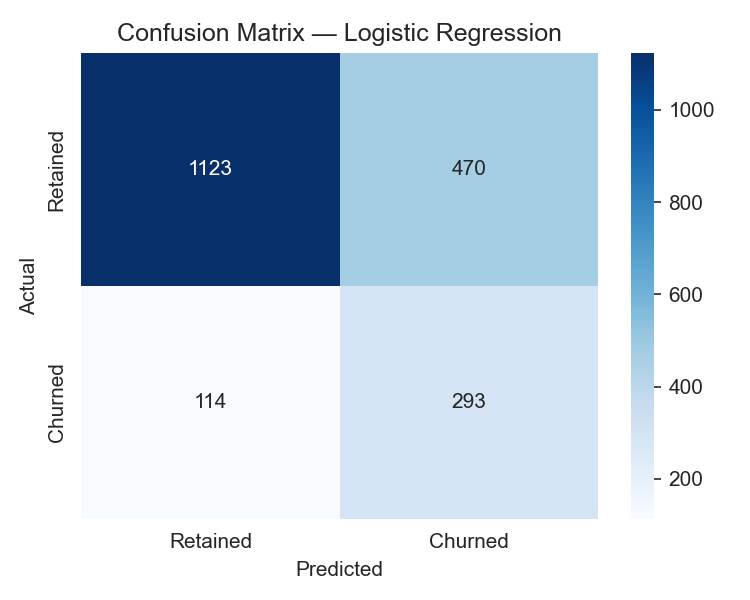
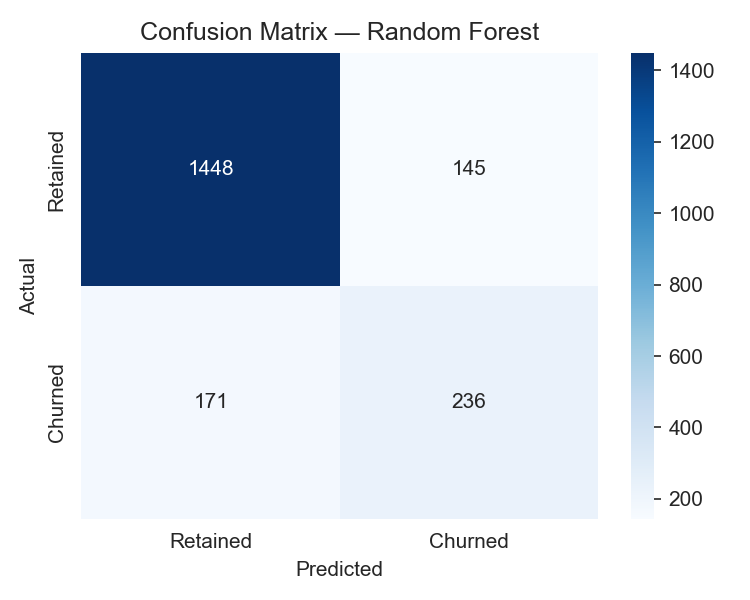
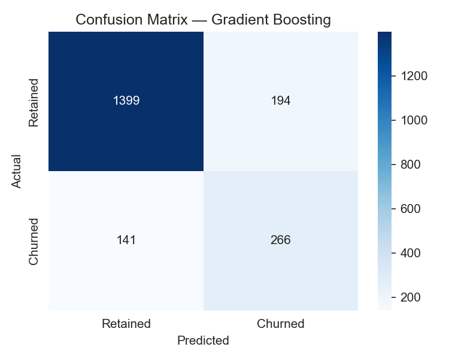

# Retail Banking Customer Churn Analysis — Prediction & Risk Segmentation

A SQL and Python analysis of 10,000 retail banking customers examining the key drivers of churn, building a rule-based risk scoring system, and developing machine learning models to predict which customers are most likely to exit — directly applicable to CRM systems, retention campaign targeting, and customer lifetime value optimization.

---

## Problem Statement
Customer churn costs retail banks 5-7x more per customer than retention. This project analyzes banking customer data to answer:
- Which customer characteristics most strongly predict churn?
- How do geography, age, and product usage interact to drive churn?
- Can machine learning accurately identify at-risk customers?
- Which customer segments represent the highest retention priority?

---

## Dataset
- **Source:** [Kaggle — Churn for Bank Customers](https://www.kaggle.com/datasets/mathchi/churn-for-bank-customers)
- **Size:** 10,000 customers, 14 features
- **Overall Churn Rate:** 20.37%
- **Geographies:** France, Germany, Spain
- **Database:** PostgreSQL (local)

---

## Tools & Libraries
- PostgreSQL, pgAdmin
- Python 3.x
- Pandas, NumPy
- Matplotlib, Seaborn
- Scikit-learn (Logistic Regression, Random Forest, Gradient Boosting)
- Imbalanced-learn (SMOTE)
- SQLAlchemy, psycopg2

---

## Project Workflow
1. Data ingestion — loaded CSV into PostgreSQL via Python, engineered age groups, balance segments, credit score bands, and salary segments
2. SQL analysis — churn by demographics, customer value segmentation, product and engagement analysis, rule-based risk scoring with Window Functions
3. Python visualization — churn overview, age and tenure analysis, product engagement, financial analysis, risk scoring, predictive modeling
4. Predictive modeling — binary churn classification using Logistic Regression, Random Forest, and Gradient Boosting with SMOTE and 5-fold cross-validation

---

## SQL Techniques Demonstrated
- Common Table Expressions (CTEs)
- Window Functions (RANK, NTILE, PARTITION BY for geographic averages)
- Multi-condition CASE WHEN for age grouping, balance segmentation, credit score banding, and risk scoring
- NULLIF for safe division in churn rate calculations
- Conditional aggregation for churned customer counting across segments

---

## Key Findings
- **Germany churn rate of 32.44%** is double France (16.15%) and Spain (16.67%) — indicating structural issues in that market requiring immediate investigation
- **Female customers churn at 25.07%** vs 16.46% for males — an 8.6pp gap suggesting systematic product or service misalignment for female customers
- **56.04% of customers aged 50-59 churn** — the bank's most severe retention failure, representing peak-earning customers with the most complex financial needs
- **3-product customers churn at 82.71% and 4-product at 100%** — the product paradox showing aggressive cross-sell destroys rather than builds loyalty; 2-product customers are the most loyal at just 7.58% churn
- **Inactive members churn at 26.85% vs 14.27% for active members** — an 88% relative difference confirming engagement as the highest-ROI retention lever the bank can directly control
- **Credit card ownership shows no protective effect** (20.81% vs 20.18%) — contradicting common cross-sell assumptions about credit card retention
- **Risk scoring produces a 7.3x churn rate differential** between Very High Risk (60.45%) and Low Risk (8.33%) — validating the framework for CRM integration and retention targeting
- **Gradient Boosting achieved the best ROC-AUC (0.86)** with balanced churn recall (0.65) and precision (0.58) — recommended for production deployment
- **Age dominates feature importance at 0.271** — more than num_of_products (0.156) and balance (0.123) combined

---

## Visualizations

### Churn Overview

### Age & Tenure Analysis

### Product & Engagement Analysis

### Financial Analysis

### Risk Scoring

### ROC Curve Comparison

### Feature Importance

### Confusion Matrices

---

## SQL Query Files
All queries are saved in the `sql/` folder:
- `01_create_table.sql` — schema creation
- `02_churn_summary.sql` — churn rate by demographics with RANK Window Function
- `03_customer_segmentation.sql` — value segmentation by balance and activity with PARTITION BY percentage calculation
- `04_product_analysis.sql` — churn by product usage and engagement combinations
- `05_window_functions.sql` — customer-level risk scoring with NTILE deciles and geographic average PARTITION BY

---

## Limitations & Next Steps
- Synthetic dataset — patterns may not perfectly reflect real-world banking
- Random Forest CV vs test ROC-AUC gap (0.96 vs 0.84) indicates overfitting
- Rule-based scoring thresholds manually defined — production needs optimization
- Future work: customer lifetime value model, survival analysis for time-to-churn, SHAP explainability, threshold tuning, Germany cohort deep dive

---

## How to Run This Project
1. Clone the repository
2. Install PostgreSQL and pgAdmin from [postgresql.org](https://postgresql.org)
3. Create a database called `banking_churn` in pgAdmin
4. Download `churn.csv` from [Kaggle](https://www.kaggle.com/datasets/mathchi/churn-for-bank-customers) and place it in the project root folder
5. Install Python dependencies: `pip install pandas numpy matplotlib seaborn scikit-learn imbalanced-learn sqlalchemy psycopg2-binary`
6. Open `churn_analysis.ipynb` in Jupyter or VS Code
7. Update the database connection string with your PostgreSQL password
8. Run all cells — data loads automatically into PostgreSQL and all analysis runs end to end

---

## Repository Structure

---

## Author
**Mihrimah Qozat**
[LinkedIn](https://linkedin.com/in/mihrimah-qozat) |
[GitHub](https://github.com/mihrimahqozat)
